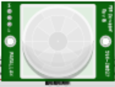
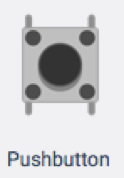
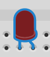
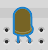
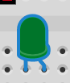

## Project 4 - Part A: Hardware/software co-design of an access control device

This part is to be solved using the TinkerCAD: https://www.tinkercad.com/ simulator as introduced in the lectures and implemented on an Arduino board.

Start by creating an account if you do not already have one. Create an ordinary user account using any of your email addresses.

If you have an Arduino board yourself at home, then you may choose to build the actual IoT access control device. Even so, it may be a good idea to prototype the device in TinkerCAD as a first step.

### Sensors

You will be using the following **sensors** with *digital input*

- A passive infrared-sensor (PIR) for detecting the approach of a person (motion)

- Two pushbuttons for entering an entry code. The order in which the buttons are pushed represents the entry code

### Actuators

You will be using the following **actuators** with *digital output*

- Three LEDs (red,yellow,green) for signalling state

### Functional and behavioral requirements

The sensors and actuators is to be controlled by software running on the microprocesser. The embedded control software is required to implement the following behaviour

1. Initially, the system is in the state `LOCKED`.

- The red LED is on when the system is in a `LOCKED` state.

- When motion is detected (via the PIR sensor), the yellow LED must be switched on; and the system is in a state `WAITING` the user to do two pushes on the buttons. After each push, the yellow LED should blink shortly.

   - If the order that the buttons are pushed is *correct*, i.e., matches order to gain access, then system will become `UNLOCKED`, and the green LED is switched on.

   - If the order it not correct, the red LED should blink and the system returns to the `LOCKED` state

After a certain amount of time in the `UNLOCKED` state, the system should automatically enter the `LOCKED` state.

To simplify the design, you can just hardcode the correct button order for access into the software.

Test your design and implementation using simulation in TinkerCAD. Make sure that you have covered the important cases, e.g., both correct and incorrect access code.

**Extra challenge:** Do some research on Arduino programming and find a solution such that if the user has not pushed two buttons within a certain amount of time in the `WAITING` state, then system should timeout and return to the `LOCKED` state.

### Make a finite-state machine model /think before you start to program

Start the assignment by drawing a [finite state machine](https://en.wikipedia.org/wiki/Finite-state_machine) that formally specifies the states of the system, and the transitions that may take place causing the system to change its state. The state machine should be derived on the description of the functional requirements above.

The finite-state machine model and a description of it will also be required for Part C - the project report. The figure can be drawn by hand or using a UML tool.

### Hardware/software co-design and implementation

With the overall design in place in the form of the finite-state machine model you may now start to perform the wiring of sensors and actuators on the Arduino board and implement the control software.

A systematic way of implementing the finite-state machine model in software is to have an integer variable is used to keep track of the current state of the system. In the first part of the `loop()`-function the software the the values of the sensors. The reading of the sensors is then followed by a switch-statement on the current state of the system with a case for each possible state of the system as per the finite-state machine model. Each case must then implement the behaviour (including any state change required) given the input from sensors and the current state of the system.

### Resources

- Arduino language reference https://www.arduino.cc/reference/en
- Arduino board layout https://www.arduino.cc/en/Reference/Board   
