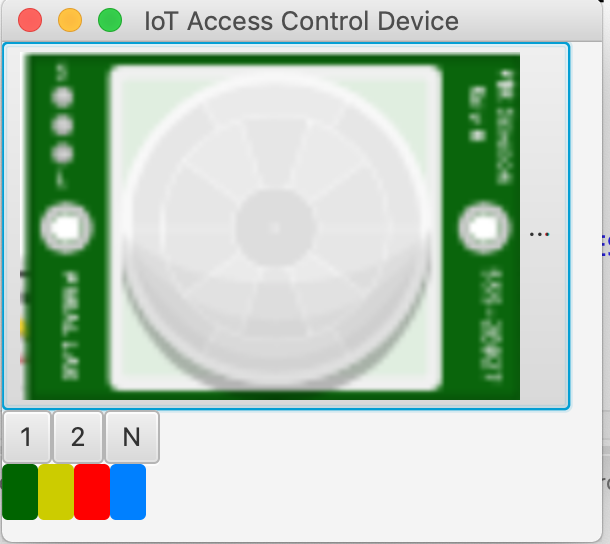

## Project 4 - Part B: Connecting the access control device to a REST-based cloud service

In this part you will be connecting your access control device from Part A to the cloud using a REST service API.

In part A you implemented the control part of the access control device using the TinkerCAD: https://www.tinkercad.com/ simulator. As TinkerCAD does not provide support for connecting the circuit design to the Internet, and as we do not have sufficient physical Arduino devices with network cards available for use, you will be provided with a virtual access control device implemented using Java.

You are then required to implement the network part of the virtual access control device which will use the HTTP protocol to connect to a REST-based cloud service implementing using the [Spark/Java micro-service framework](http://sparkjava.com). At the end of part B, you should have a complete IoT-cloud system solution in which the IoT access control device is connected to a cloud service making it possible to track when the system has been locked/unlocked and also change the current access code.

The principles that you will apply to develop your IoT-cloud solution is similar to what was demonstrated in the lectures on IoT by means of the red-green counters examples.

### Security and persistent storage

In a complete implementation of the system, we would also ensure that the service is secure by means of

- *confidentiality* using transport layer security to encrypt the communication between the IoT access control device and the cloud service

- *authentication* such that only authenticated software can access the cloud service

- *authorisation* such that only an *owner* could retrieve the access log and such that only an *administrator* would be able to change the access code.

As we have not yet covered security in the course, we will omit this. Once you have learned about security, you are encouraged to revisit your implementation and implement security mechanism as outlined above. This is not mandatory.

In a complete implementation, the cloud service would also use a database for storing the information related to the REST service such that it becomes persistent across starts and stops of the service. The system would also implement fault-tolerance such that the access log was updated even if the access control device may have been without network connectivity for a while. For this project, we simply store the information in memory in the service. So be aware that information will be lost between restarts.

### Step 1: Clone the virtual access control device and import it into the IDE

The implementation of the sensor-actuator control for the access control device can be found in the following Eclipse-project:

https://github.com/selabhvl/dat110-project4-startcode-iotdevice.git

The project implements a virtual access control device with similar to what was to be completed in Part A. The project is organised into the following packages:

- `no.hvl.dat110.aciotdevice.main` contains the main-method for the virtual device

- `no.hvl.dat110.aciotdevice.ui` implements the sensors and actuators as JavaFX-elements

- `no.hvl.dat110.aciotdevice.pins` implements the input/output pins and wiring of the virtual device

- `no.hvl.dat110.aciotdevice.controller` implements the control-loop of the virtual device

- `no.hvl.dat110.aciotdevice.client` will contain the implementation of the network part of the virtual device acting as a client (consumer) of the REST-based cloud service. You are to implement this part in Step 4 below.

If you are using version 1.8 or earlier of JDK then you can start the application by simply running the main-method that can be found in the `Main`-class.

It you have JDK 1.9 or higher installed, then you need to configure JavaFX for the project since the application relies on JavaFX.

The steps are described here:

https://github.com/selabhvl/dat110public-2020/blob/master/javafx/INSTALL.md

If you already downloaded the JavaFX library as part of project 2 (on the chat-application), then it suffices to do steps 3 and 4 in the above guide.

Running the launch configuration created when setting up JavaFX should result in the following window where you can interact with the PIR-sensor (by clicking it) and also push the buttons labelled `1` and `2`. The green, yellow, and red LEDs are represented by the accordingly coloured boxes.

The difference compared to Part A is that the device now has an extra button labelled `N` (Network) and a blue LED. The `N` button can be pressed in order to put the device into *network mode* in which case the blue LED will be turned on.

When the blue led is on and the device is in network mode, then the device will retrieve the current access code from the cloud service and it will report entries to the access log of the cloud service.



The implementation of the logic for controlling the sensors and actuators can be found in the `AccessController.java` class. It follows the same reactive programming model as on the Arduino-device. This means that the `setup`-method is executed once at startup, and the `loop`-method is continuously executed. The base class `MicroController.java` also provides similar library functions as on the Arduino.

The `AccessController.java` class implements one possible solution for Part A. If you want, you can replace/integrate the implementation with your own implementation from Part A. Few changes to the C/C++ code should be required in order to make it run under Java.

It should only be necessary to make changes to the classes in the `client`-package in order to complete Step 4 below.   

### Step 2: Cloud service and REST API

In this step you will implement the cloud service that the access control device can use by providing a REST API implemented using the [Spark/Java micro-service framework](http://sparkjava.com).

The Eclipse-project that is to be used as a starting point is available via:

https://github.com/selabhvl/dat110-project4-startcode-cloudservice.git

and provides the basic setup required to implement the service. It is organised as a [Maven-project](https://maven.apache.org) in order to automatically download the externally libraries required. The external dependencies are declared in the `pom.xml` file.

The Java source code is available in the `src/main/java` folder.

Start by testing that you are able to run the REST service server locally on your machine:

- Run the `main-method` of the service in the `App.java` class which will start the server a basic REST service.

- Point your browser to the following URL: http://localhost:8080/accessdevice/hello

and you should see text `"IoT Access Control Device"` in the browser window as a result of having executed the HTTP GET request in the browser.

You are to implement the operations to be supported by the cloud-service. The cloud-service should make it possible for the access control device to register attempts to access the system in an access log. Furthermore, the cloud-service should make it possible to change the access code for entry and the access control device should be able to retrieve the current access code.    

Specifically, the following HTTP operations should be supported:

- `POST /accessdevice/log/` should record an access attempt by storing the log-message contained in the body of the HTTP request in the cloud service. The body of a HTTP POST request is a JSON representation of an object of the class `AccessMessage.java` (implementation already provided). As an example, the HTTP request body may contains the following:

 ```JSON
{
    "message": "locked"
}
```

 as a result, the service should return a HTTP response containing a JSON representation of an object of the class `AccessEntry.java` which in addition to the message also contains a unique identifier for the access log entry created as a result of the HTTP request. As an example:

 ```JSON
 {
    "id": 1,
    "message": "locked"
}
```

- `GET /accessdevice/log/` should return a JSON-representation of all access log entries in the system, i.e., collection of objects of class `AccessEntry.java`. As an example:

 ```JSON
[
    {
        "id": 1,
        "message": "locked"
    },
    {
        "id": 2,
        "message": "unlocked"
    }
]
```
- `GET /accessdevice/log/{id}` should return a JSON representation of the access entry identified by `{id}`. As an example:

 ```JSON
{
    "id": 1,
    "message": "locked"
}
```

- `PUT /accessdevice/code` should update the access code stored in the cloud service to a combination of the `1` and `2` buttons. The new access code is to be contained in JSON format in the body of the request as a representation an an object of the class `AccessCode.java` (already implemented). As an example:

 ```JSON
{
    "accesscode": [
        2,
        1
    ]
}
```

and in the body of the response, the service should return the exact same JSON-object.

- `GET /accessdevice/code` should return a JSON-representation of the current access code stored in the server. This is what the access device will used in order to update the access code.

- `DELETE /accessdevice/log/` should delete all entries in the access log and a return a JSON-representation of the empty access log in the body of the HTTP response.

In order to implement the above API you will have to use the primitives available in the Spark/Java framework. The documentation is available here:

http://sparkjava.com/documentation

It should be sufficient to read the parts on *Routes*, *Requests*, and *Responses*.

The access attempts and associated message should be stored in memory and each log message received via the POST HTTP operation should be given a unique identifier. You may use a [Concurrent HashMap](https://docs.oracle.com/javase/8/docs/api/java/util/concurrent/ConcurrentHashMap.html)  for storing the log-messages received from the device and an [Atomic Integer](https://docs.oracle.com/javase/8/docs/api/java/util/concurrent/atomic/AtomicInteger.html) for keeping track of the identifier. The hash-map should use the identifier as the key for the log-message.

The start of implementation has already been provided in the `AccessLog.java` class.

For the JSON-representation, we will use the GSON-library:

https://github.com/google/gson

The Maven-setup of the cloud-service makes sure to automaitcally download this library.

The examples on Spark/Java and also GSON from the lectures on IoT is available from here:

- https://github.com/selabhvl/dat110public-2021/blob/master/week16/IoTCounter/counters/counters/src/main/java/no/hvl/dat110/cloudservice/App.java

- https://github.com/selabhvl/dat110public-2021/blob/master/week16/IoTCounter/counters/counters/src/main/java/no/hvl/dat110/cloudservice/Counters.java

### Step 3: Testing the cloud service

The operations of the cloud service relying on HTTP GET can easily be tested from a browser.

To conduct a more complete test of the service implemented in step 2 you are to download and install the [Postman-tool](https://www.getpostman.com/tools). The tool makes it possible to construct HTTP requests and run these against a service as was also demonstrated in the lectures on IoT.

You should create requests in the Postman-tool and test all the operations/services that were implemented in step 2.  

### Step 4: Implementing device network communication

The next step is now to implement the network communication in the access control device which is to use some of the services implemented in step 2.

The implementation of the network communication is to be provided in the `RestClient.java` by completing the implementation of the following methods:

- ```public AccessCode doGetAccessCode()``` which is to issue a HTTP GET request on the cloud service in order to obtain the current access code. This method will be called from the loop-function in the `AccessController.java` class immediately before checking whether a provided access code is valid, i.e., in state `CHECKING`.

- ```public void doPostAccessLogEntry (String message)``` which is to issue a HTTP POST request on the service in order to add a log access entry for the message. This method will be called from the loop-function in the `AccessController.java` class if access is denied in the `CHECKING` state and when the system becomes `UNLOCKED` and `LOCKED`.  

Both of the methods should establish a connection to the cloud-service and issue the appropriate HTTP GET and HTTP POST requests, i.e., following the format for HTTP request messages which can be found on pages 133 and 135 in the networking book.

The code from the IoT lectures illustrating construction of HTTP requests can be found via:

https://github.com/selabhvl/dat110public-2020/tree/master/week16/IoTCounter/counters/counters/src/main/java/no/hvl/dat110

If you choose to use the okhttp library for your implementation, then you will have to download the the library from:

https://mvnrepository.com/artifact/com.squareup.okhttp/okhttp

and add it to the build path of the Eclipse-project.

### Step 5: System testing

Test that the implementation works properly by attempting to access the device and see that the log in the cloud service is properly updated. Try also to provide an incorrect access code. Try to also change the access code by sending a request from the Postman tool and see that the access control device correctly obtains/uses the new access code.

Make sure that you have put the device into network mode first by pressing the `N` button.

### Step 6: Cloud deployment - **Optional**

As a final step you may deploy the service in the cloud. There are several options - two of which are listed below.

1. Deploy the service on [Amazon EC2](https://aws.amazon.com/ec2/) by creating a virtual machine in the free-tier. One way to deploy the Spark/Java service is to

 - Install Java, Maven, and git on the virtual machine
 - Check out the code using git on the virtual machine
 - Build the REST-service using maven: ```mvn package```
 - Start the service by starting the jar-file packaged above   
 - In order to be able to connect to the service you have to make sure that the TCP port used for the service is open in the security setting of the virtual machine, and that the port is not blocked by the firewall of the virtual machine.

- Deploy the service on [Heroku](https://www.heroku.com) following the instruction that can be found here: https://sparktutorials.github.io/2015/08/24/spark-heroku.html

You also have to change the settings in the `Configuration.java` class to make sure that the access control device connects to your cloud-deployed service.
