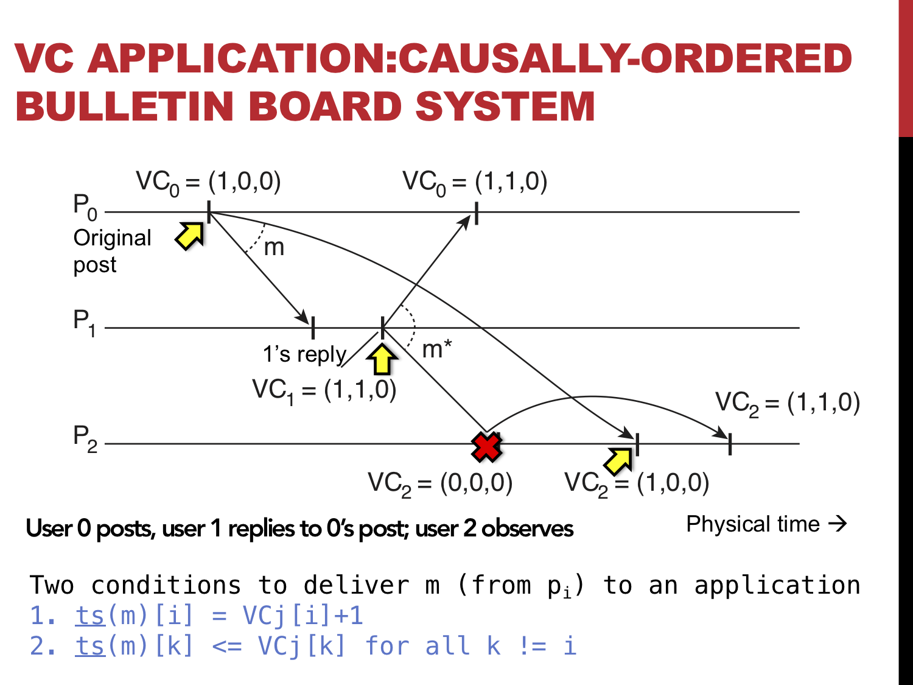

### Lab Week 10: 06/03 - 10/03

#### Exercise 0 - Completing Project 2
Complete the tasks on project 2:

#### Exercise 1 - Lamport Clock (Chapter 6. pg 310-316)

This exercise is based on Section 6.2 of the distributed system book. The goal is to show how event ordering in distributed systems can be achieved by using Lamport logical clock.

The implementation is based on a totally-ordered multicasting where every process has the same copy of the queue first before performing their operations. This is the most basic implementation but can be optimized. A totally-ordered multicasting is crucial for replicated services to keep replicas consistent by ensuring that each replica execute the same operations in the same order.

To get started, download the project and import it to your Eclipse IDE. Project can be downloaded here: https://github.com/selabhvl/dat110public/tree/master/week10/LamportClock-exercise

The processes communicate using the Java RMI. Current implementation uses three separate clients each with a main thread on a single computer to simulate inter-process communication in a distributed system. You can use multiple computers by changing the registry configuration and specifying the IP addresses of the communicating hosts in the Util/ProcessContainer classes

The project is organized as follows:

- no.hvl.dat110.ds.clients: contains three client processes (client1, client2, & client3). Each client initiates some operations such as requestDeposit, requestInterest, or requestWithdrawal to the replica process.

- no.hvl.dat110.ds.middleware: contains the 'process' class that implements the Lamport clock and its application using three operations (deposit, interest, and withdrawal). ProcessContainer class is the 'server' for the 'process' class. This is where the registry is started and where the binding of the process implementation to the registry is done. Message class is used to construct the message to be passed between the processes.

- no.hvl.dat110.ds.middleware.iface: contains the process interface (ProcessInterface) where remotely-invocable methods are defined and the OperationType that defines what type of operation we want to perform

- no.hvl.dat110.ds.util: contains the LamportClock class where the basic operations to increment, replace, or return the current clock value are implemented. It also contains the Util class with various methods for obtaining registry or performing conversion and printing the clock states for each process.

- no.hvl.dat110.ds.test: contains JUnit test (LamportClockTest) class that is used to test the result whether the state of the resource (balance) is consistent across the processes after the operations.

##### Task-1: Run the project
Study the code and understand the connections between the classes. The configuration follows the same style we have used for previous Java RMI labs.
Run the project using the LamportClockTest junit test and confirm that the the test fails because the final balance is different at each replica. You will find that a default value is used for the balance in the 'Process' class (private double balance = 1000;	// default balance).

##### Task-2: Implement these missing methods in the "Process" class

- private void sortQueue(): Recall that sorting the queue based on the logical timestamp and the processid (to break ties) is important to achieving a totally-ordered events (queue). Your task is to sort the queue first on the clock and then on the processid.

- public void requestDeposit(double amount): A client can make a request from the middleware (this process) to perform an operation (e.g. deposit). Use the idea from requestInterest to complete this task.

- public void requestWithdrawal(double amount): A client can make a request from the middleware (this process) to perform an operation (e.g. make a withdrawal). Use the idea from requestInterest to complete this task.

- public void applyOperation():  This method is called when the client is finished with all the operations. This method is where all operations that have been received from remote processes and the local operations are processed. First, sorting is performed to provide a total ordering, after which the operations can be applied and committed to the datastore (shared variable)

- private void multicastMessage(Message message): When an operation is performed (e.g. requestDeposit), we need to propagate this message to the remaining replicas. This class is responsible for sending the operation to the other replicas

- public void onMessageReceived(Message message): When a remote replica receives a message (operation) from another replica, it has to be stored in the queue, sorted, compare the clock of the incoming message to the local clock and apply lamport clock rule2 - new clock value should be the greater of the two. Thereafter, we increment the local clock and lastly multicast acknowledgement to other processes

#####  Testing
- Run the LamportClockTest unit test. Correct result will show that the events are totally-ordered in each replica and the final value of the datastore is the same in all replicas.

#### Exercise 2 - Vector Clock (Chapter 6. pg 316-321)

We have discussed that Vector clock can be used to capture potential causal relationships between messages during exchanges. This exercise is meant to further illustrate this concept by providing an implementation of Vector clock. We are using the example on page 320 of the Distributed System book as shown in the figure below.

A middleware should not deliver a message to an application if messages that precede this message have not been delivered. A way to enforce this rule is to use Vector clock at the middleware layer.
To demonstrate this concept, you are provided with framework where you can implement the correct functioning of the Vector clock. The processes communicate using the Java RMI. Current implementation uses three separate clients each with a main thread on a single computer to simulate inter-process communication in a distributed system. You can use multiple computers by changing the registry configuration and specifying the IP addresses of the communicating hosts in the Util/ProcessContainer classes
A client can build a message by using the buildMessage() method and multicast the message using multicastMessage() method to other replicas.
When processes exchange messages concurrently, the vector clock must also be consistent. We simulate communication delay by making the processes to wait (sleep) between sending messages. Another variant is to specify the dependency between two processes using WaitForEvent class.

To get started, download the project and import it to your Eclipse IDE. Project can be downloaded here: https://github.com/selabhvl/dat110public/tree/master/week10/VectorClock-bulletin-exercise

The project is organized as follows:

- no.hvl.dat110.ds.clients: contains three client processes (client1, client2, & client3). Each client initiates two operations buildMessage and multicastMessage. A multicastMessage(delay) is used when we want to simulate communication delay (as shown in the diagram where message from P0 arrived later than message from P1)

- no.hvl.dat110.ds.middleware: contains the 'process' class that implements the Vector clock and its application using three operations (buildMessage, multicastMessage, and multicastMessage(long)). ProcessContainer class is the 'server' for the 'process' class. This is where the registry is started and where the binding of the process implementation to the registry is done. Message class is used to construct the message to be passed between the processes.

- no.hvl.dat110.ds.middleware.iface: contains the process interface (ProcessInterface) where remotely-invocable methods are defined and the OperationType that defines what type of operation we want to perform

- no.hvl.dat110.ds.util: contains the Util class with various methods for obtaining registry or performing conversion and printing the clock states for each process.

- no.hvl.dat110.ds.tests: contains JUnit tests (VectorClockTest, VectorClockTest2, VectorClockTest3) classes that are used to test the result whether the vector clock is consistent in the face of concurrency or delay across the processes after the operations.

##### Task-1: Run the project
Study the code and understand the connections between the classes. The configuration follows the same style we have used for previous Java RMI labs.
Run the project using the VectorClockTest junit test classes only and confirm that the the test fails because the vectorclock values are wrong. Do not use the other two unit test classes (VectorClockTest2 & VectorClockTest3) yet until you finish with your implementation. If you run them, you'll not get any result and you will then need to terminate them from the console.

##### Task-2: Implement these missing methods

###### VectorClock class
- public void updateClockRule1():  Implement the first rule to update the local clock

- public void updateClockRule2(VectorClock vci): Implement the 2nd rule to update local clock by obtaining the greater clock value for each clock index.

- public boolean deliverMessage(VectorClock vi): Implement the logic that checks the two conditions that are necessary for a process to deliver a message to an application

###### VectorProcess class
- public void multicastMessage(): Implement multicast of message to the remaining replicas excluding self

- public void multicastMessage(long delay): Implement multicast of message to the remaining replicas but set a delay between sending of the message (i.e. wait for a few sec before sending to the next replica)

- public void onReceivedMessage(Message message): When a replica receives a multicast message, check that the messages preceding this message have been delivered by using the VectorClock (deliverMessage method) otherwise queue this message.

#####  Testing
- Run the three unit tests in the no.hvl.dat110.tests package. All tests must pass showing the final vectoclock value at each process.

#### Exercise 3 - Mutual Exclusion - Distributed Algorithm (Chapter 6. pg 323-325)

- Optional challenge without any code skeleton for the algorithm.

- Duplicate the LamportClock-exercise project

- Use the same Java RMI framework for the LamportClock exercise and implement a mutual exclusion distributed algorithm such that before each process can commit (apply their operations) they must obtain permissions from the remaining replicas.
That implies that when the client calls "public void applyOperation()" method, the permission process begins. A process can only commit if it obtains permissions from the remaining replicas.
It is also possible that when a process finishes committing to the datastore it can tell other processes in its queue to go ahead and commit to the datastore.

- If your implementation is correct, the balance will be the same across all replicas at the end of the operations.

- Use the same unit test class (LamportClockTest) to test your implementations.
