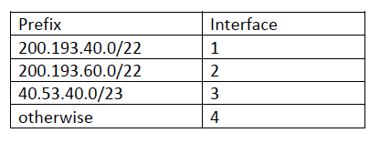

## DAT110: Distributed Systems and Network Technology

### Lab Week 13: 27/3 - 31/3

### Exercise 1: Project work

Complete the remaining tasks on project 3.

### Exercise 2: Network interfaces and IP address configuration

Make sure that your PC is connected to your local area network either via cable or via WiFi.

Start a terminal (mac) or a command prompt (windows) on your PC. Use the `ifconfig` (mac) or `ipconfig` (windows) command-line tools to find the following information:

1. What IP network interfaces does your PC have?
- What is the IP address of each network interface?
- What is the link-layer address of each network interface?
- What is the network mask and network address of each interface?
- What DNS server(s) have been configured?
- What default gateways have been configured?

In case the `config` command does not provide information about DNS server(s) you can use the `nslookup` command-line tool.

### Exercise 3: Connectivity and routes

Start a terminal (mac) or a command prompt (windows) on your PC.

Use the `ping` tool to check Internet connectivity to the `www.example.com` host.

Use the `traceroute` (mac) / `tracert` (windows) tool to obtain information about the route that a datagram travels from your PC to the `www.example.com`host.

1. What are the IP addresses of the interfaces that the datagrams passes through.

2. Can you locate the IP address of your default gateway as identified in Exercise 14.2 on the route?

### Exercise 4: Dynamic Host Configuration Protocol

Start the WireShark application and set it up such that it captures packets on the network interface with which you are connected to the Internet (wireless or cabled interface).

We will study the operation of the DHCP protocol. To see only DHCP packets in Wireshark, you can use `bootp` as a filter.

Now do the following:

1. Switch of your cabled or wireless network interface on your PC (can also be done using flight mode).
2. Use `ifconfig/ipconfig` (as in Exercise 14.2) to see whether your network interface is configured with an IP address (it should not be)
3. Try to switch on the network interface again. What DHCP packets are captured by WireShark?
4. Use `ifconfig/ipconfig` again to check that your network interface has now been configured.

### Exercise 5: Networking status

Experiment with the `netstat` command-line tool on your PC.

What kind of information does the tool provide?

### Exercise 6: Fragmentation and Maximum Transfer Unit

Consider an IPv4 datagram with a total size of 3000 bytes (including a 20 byte header) that needs to be transmitted across a communication link where the maximum transfer unit (MTU) is 1620 bytes.

Assume that the original datagram identification is 888.

1. How many IP datagrams will the original IP datagram be divided (fragmented) into?
2. What is the amount of data, identification, offset, and flag in the resulting IP datagrams?

See also slides from the lecture on Network Layer I.

### Exercise 7: IP addresses and routing - Exam exercise from 2019

#### a)

What 32-bit bit-pattern does the IP address 224.192.40.7 correspond to?

#### b)

Consider the CIDR (Class Internet Domain Routing) address block 224.192.40.0/22. What interval of addresses does this block span?

#### c)

Consider a router with the following forwarding table.

At which interface (1-4) will the router forward datagrams with the following destination IP addresses? (justify the answers)

1.	200.193.42.10
2.	200.193.57.14
3.	10.53.40.7
