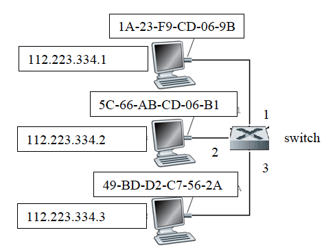

## DAT110: Distributed Systems and Network Technology

### Lab Week 16: 13/4 - 17/4

### Exercise 16.1: Network Layer - Data Plane

Chapter 4 in the networking book:

- Review questions: R9, R17, R20, R21, R22, R24
- Problems P1, P5, P6, P7, P8, P11, P12, P14, P15, P16

### Exercise 16.2: Network Layer - Control Plane

Chapter 5 in the networking book:

- Review question R5
- Problems P3 and P8

### Exercise 16.3: Stopable-thread abstraction

TO BE ADDED

### Exercise 16.4: Network Layer Framework

TO BE ADDED

### Exercise 16.5: Link-layer - Exam Exercise 2019

##### a)

Explain what information is stored in an ARP table

##### b)

Consider a local area network consisting of three hosts with IP and MAC addresses as specified in the figure below and a switch with interfaces numbered 1-3 as specified in the figure. Assume that the ARP tables on all hosts are empty and that the switch-table on the switch is empty.

What is the content of the ARP table on the host with IP address 112.223.334.1 after an IP datagram from 112.223.334.1 to 112.223.334.3 has been sent? **Justify your answer**

##### c)

What will the content of the switch-table be after an IP datagram from 112.223.334.1 to 112.223.334.3 has been sent? **Justify your answer**
