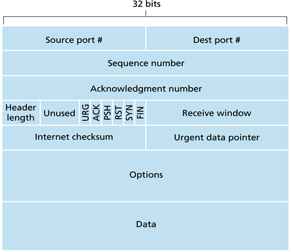

## DAT110: Distributed Systems and Network Technology

### Lab Week 9: 27/2 - 3/3

### Exercise 1 - Project work

Complete the tasks on project 2:

https://github.com/selabhvl/dat110-project2-startcode/blob/master/README.md

### Exercise 2 - Transport Layer and UDP

Consider the UDP example that was discussed in the lectures:

https://github.com/selabhvl/dat110public/tree/master/week8/udpmultiplexing

Run the client and the server and use Wireshark to observe the UDP segments that are transmitted. You may use a filter to observe only UDP segments.

How are ports being used in the UDP segment to support multi-plexing and a request-reply communication pattern.

### Exercise 3 - Transport Layer and TCP

Consider the TCP example that was discussed in the lecture:

https://github.com/selabhvl/dat110public/tree/master/week3/tcpexample/src/no/hvl/dat110/tcpexample

Run the client and the server and use Wireshark to observe the what TCP segments are transmitted. You may use a filter to observe only TCP segments.

What TCP segments are used to opening the TCP connection, how are sequence numbers used during data transfer, and what segments are used to close the connection.

### Exercise 4 - Reliable Data Transfer

Exercises 4-5 related to the RDT framework for reliable data transfer:

https://github.com/lmkr/dat110-rdt

that were introduced in the lectures. You may want to do exercise 1-2 first in case you did not complete them in the previous week.

### Exercise 5 - Exam Question from Spring 2019

The figure below shows the format of the segments exchanged in the TCP protocol.

#### a)

Explain briefly what service the TCP protocol provides and the function of the segment fields: Source port, Dest port, Sequence number, Acknowledgment number, Receive window, Internet checksum, and Data

#### b)

Assume in the following a configuration of the Selective Repeat Protocol with a window size of 3 and assume that the first three data packets with sequence numbers 1,2 and 3 are transmitted. How would the protocol react in case all three data packets are lost?

#### c)

What would happen if all three data packets are received and only the acknowledgment for data packet 3 is successfully received (acknowledgements for data packet 1 and 2 are lost)?

#### d)

Suggest a segment format that could be used to implement the Selective Repeat Protocol in case sequence numbers can be represented by 4-bits and the data payload can be between 0 and 127 (2^7-1) bytes
